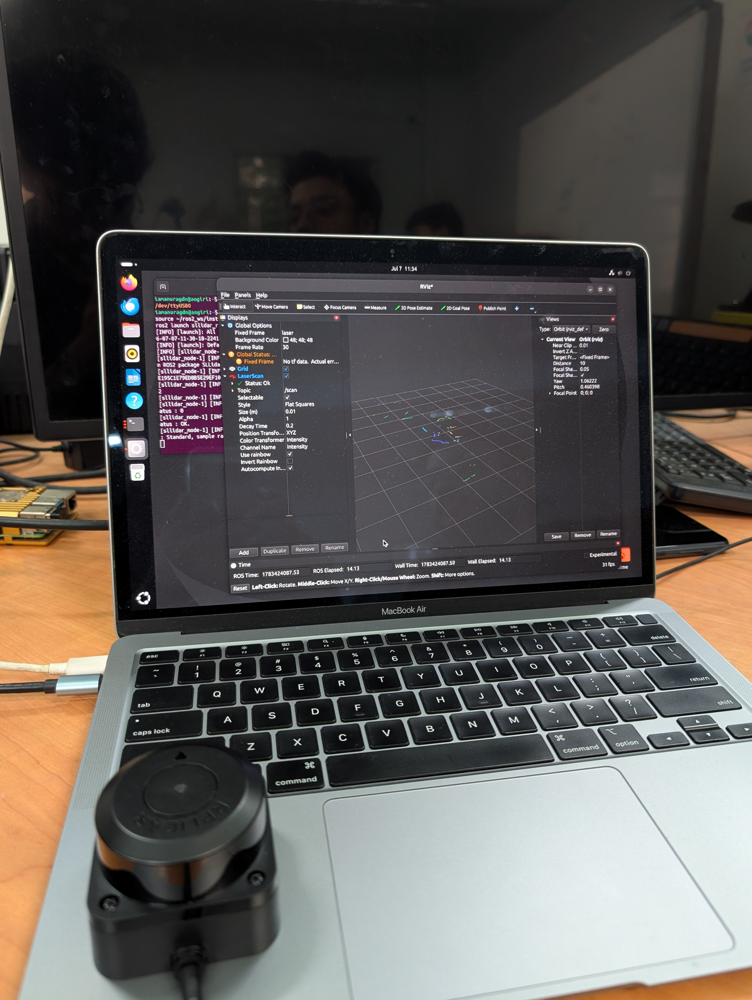
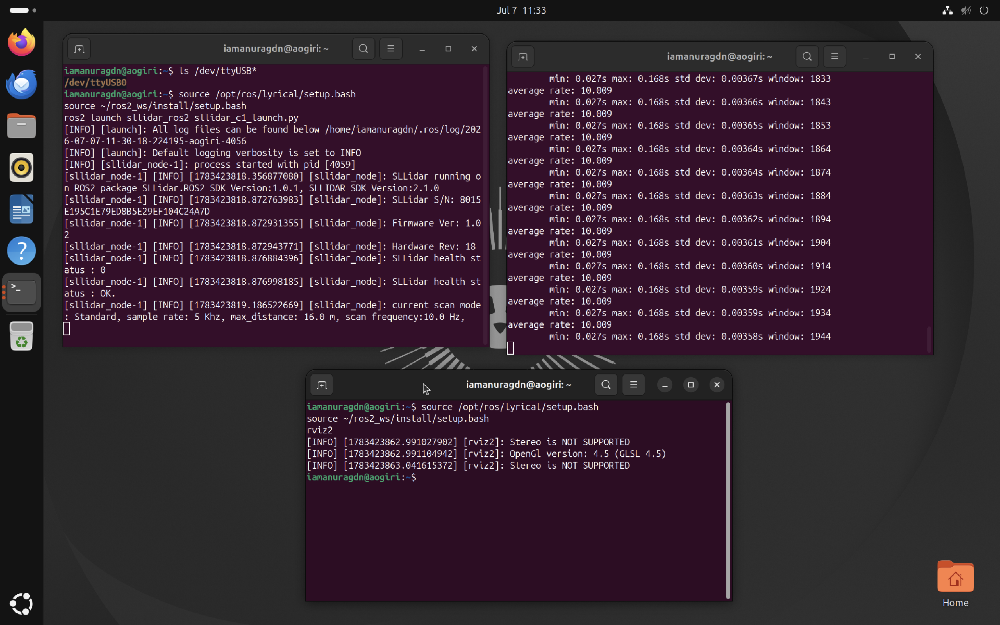
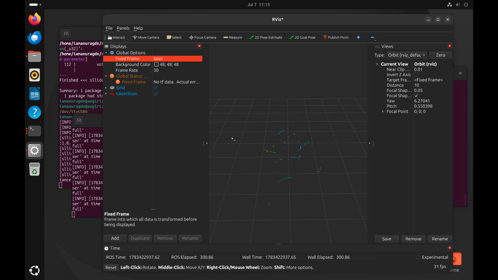

# Internship Weekly Log: Week 6

**Developer:**  Anurag Debnath and Abhilash Ghosh
**Date:** July 7, 2026

---

## Day 1: July 7, 2026

### Robotics — SLAMTEC RPLIDAR C1 Integration with ROS 2 on a Virtualized Ubuntu Environment

**Hardware:** SLAMTEC RPLIDAR C1 (CP2102N USB-to-UART bridge)
**Environment:** Apple Silicon (M1) Mac, UTM (QEMU), Ubuntu 26.04 (Resolute) guest, ROS 2 Lyrical


#### 🧠 What is ROS, and Why ROS 2?

**What is ROS?**
ROS (Robot Operating System) isn't actually an operating system like Windows or macOS. Instead, it acts as a communication network that helps all the different software parts of a robot talk to each other. 

It breaks down into four main concepts:
* **Nodes:** Mini-programs that handle one specific task, like reading sensor data.
* **Topics:** The "chat channels" where Nodes broadcast or listen for information.
* **Messages:** The actual data being sent through the Topics.
* **Packages:** Folders that organize all these related codes and files together.

Because of this setup, a sensor can just broadcast its data without worrying about what other program is reading it.

**Why ROS 2 Instead of ROS 1?**
Using ROS 2 wasn't just a preference; it was practically required. Here is why:
* **Compatibility:** ROS 1 is discontinued and simply does not work on newer operating systems like Ubuntu 26.04.
* **Better Reliability:** ROS 1 relied on a single "master" process; if that crashed, the whole robot system broke. ROS 2 is decentralized, making it much safer and closer to real-world industrial standards.
* **Future-Proofing:** ROS 2 supports real-time systems, runs on smaller embedded hardware, and is where all active robotics development is happening today.


#### ✅ What I Did

**1. VM & USB Passthrough (Hardware Detection)**
* **The Issue:** UTM was not detecting the RPLIDAR C1 at all (`lsusb` and `ls /dev/ttyUSB*` were empty).
* **The Fix:** Discovered that in newer UTM versions, the USB device must be attached *after* the VM is already running (via the hidden top toolbar), rather than at boot.

**2. Serial Port Permissions**
* **The Issue:** Even when `/dev/ttyUSB0` appeared, the default user couldn't read the raw data. 
* **The Fix:** Granted permissions using `sudo usermod -aG dialout $USER` and rebooted the VM.

**3. ROS 2 Distro Matching**
* **The Issue:** Tried installing `ros-humble-desktop` and `ros-jazzy-desktop` first, but both failed with `Unable to locate package`. Ubuntu 26.04 requires the newer **ROS 2 Lyrical** release. 
* **The Fix:** Successfully installed `ros-lyrical-desktop` instead.

**4. Build Tooling (Missing Compiler)**
* **The Issue:** The first `colcon build` attempt failed immediately with `No CMAKE_CXX_COMPILER could be found` because a fresh Ubuntu install has no compiler by default. 
* **The Fix:** Installed the required toolchain by running `sudo apt install build-essential`.

**5. CMake Macro Break (Lyrical-Specific Patch)**
* **The Issue:** Compiling hit a harder error: 
    ```text
    CMake Error at CMakeLists.txt:50 (ament_target_dependencies):
      Unknown CMake command "ament_target_dependencies".
    ```
    While this looks like a "forgot to source the workspace" issue, `ament_cmake` in **Lyrical actually removed/changed the `ament_target_dependencies` macro** that older packages like `sllidar_ros2` still use. Sourcing didn't fix it because the macro no longer exists in this distro.
* **The Fix (Manual Patch):** Replaced every `ament_target_dependencies(<target> <deps>)` call in the package's `CMakeLists.txt` with the modern target-based form:
    ```cmake
    # Old (broken on Lyrical)
    ament_target_dependencies(sllidar_node rclcpp std_srvs sensor_msgs)

    # New (Lyrical-compatible)
    target_link_libraries(sllidar_node
      rclcpp::rclcpp
      ${std_srvs_TARGETS}
      ${sensor_msgs_TARGETS}
    )
    ```
* **The Result:** Applied this to both build targets (`sllidar_node` and `sllidar_client`), then rebuilt clean:
    ```bash
    rm -rf build install log
    source /opt/ros/lyrical/setup.bash
    colcon build --symlink-install
    ```
    The build finished cleanly (`Finished <<< sllidar_ros2 [11.4s]`), leaving only harmless SDK compiler warnings (unused parameters, deprecated `spin_some`).

**6. Launched the LiDAR Node**
* **The Action:** Ran `ros2 launch sllidar_ros2 sllidar_c1_launch.py` to connect to the physical sensor.
* **The Result:** Confirmed it was healthy and scanning. 
    * Successfully read the serial number, firmware version, and hardware revision directly off the device.
    * Status: `SLLidar health status : OK.`
    * Scan mode: Standard, 5 KHz sample rate, 16.0 m max range, **10.0 Hz** scan frequency.

**7. Verified the Data Stream**
* **The Action:** Ran `ros2 topic hz /scan`.
* **The Result:** Confirmed a steady **~10.008 Hz** publish rate with very low jitter (std dev ~0.002s), which almost exactly matches the sensor's reported scan frequency.

**8. Visualized in RViz2**
* **The Action:** Brought up `rviz2`, set the **Fixed Frame** to `laser` (since there is no `map` frame in a raw driver setup without SLAM running), and added a `LaserScan` display on `/scan`.
* **The Issue:** The initial 3D view flickered heavily.

**9. Fixed the RViz Flicker**
* **The Issue:** The LaserScan display's default **Decay Time is 0**, which clears every scan the instant the next one arrives at 10 Hz, creating a visual strobe effect. 
* **The Fix:** Set the Decay Time to `0.2` and bumped the point **Size (m)** up from the near-invisible default. This resulted in a smooth, continuously visible scan trace.

**10. Fixed Dropped Scans in RViz (Queue Size)**
* **The Issue:** The terminal was logging repeated `Message Filter dropping message for frame 'laser'... reason 'Discarding message because the queue is full'` warnings — a separate cause of dropout from the Decay Time issue above.
* **The Cause:** The LaserScan display's internal message queue (default size `10`) was filling up faster than RViz could render each frame.
* **The Fix:** Increased **Queue Size** on the LaserScan display from `10` to `30`, giving RViz more buffer room and eliminating the dropped-frame warnings. Confirmed via `ros2 topic hz /scan` that the underlying publish rate was steady throughout — the drops were a rendering-side backlog, not a sensor/data problem.

#### 📸 Visual Evidence
<table>
  <tr>
    <td rowspan="2" align="center" width="50%" valign="middle">
      <b>1. Hardware & VM Setup</b><br>
      MacBook Air (M1) running Ubuntu VM with SLAMTEC RPLIDAR C1 connected via UTM.<br><br>
      
    </td>
    <td align="center" width="50%" valign="middle">
      <b>2. ROS 2 Terminal Nodes</b><br>
      Running the sllidar node, measuring ~10Hz publish rate, and launching RViz.<br><br>
      
    </td>
  </tr>
  <tr>
    <td align="center" width="50%" valign="middle">
      <b>3. RViz2 Visualization</b><br>
      Live 3D point cloud plotting the /scan topic with adjusted decay time.<br><br>
      
    </td>
  </tr>
</table>

<br>


#### 📊 Results

| Metric | Value |
|--------|-------|
| **Sensor** | SLAMTEC RPLIDAR C1 |
| **USB Bridge Chip** | CP2102N |
| **Guest OS** | Ubuntu 26.04 (Resolute) |
| **ROS Distro** | ROS 2 Lyrical |
| **Serial Port** | `/dev/ttyUSB0` |
| **Scan Frequency (reported)** | 10.0 Hz |
| **Scan Frequency (measured via `topic hz`)** | ~10.008 Hz, std dev ~0.002s |
| **Max Range** | 16.0 m |
| **Sample Rate** | 5 KHz |
| **Health Status** | OK |
| **Build Result** | Clean (`colcon build`, 0 errors after CMakeLists.txt patch) |


#### 🧠 Key Learnings

- **A "sourcing" error and a "removed macro" error can look identical.** Both throw `Unknown CMake command`. Sourcing the workspace is the first thing to check, but if the environment is correctly sourced and the error persists, the actual package code may be incompatible with the distro's `ament_cmake` version — worth checking the package's `CMakeLists.txt` directly rather than re-sourcing repeatedly.
- **Bleeding-edge distros break older packages.** Being on the newest possible ROS 2 release (Lyrical) means some community packages, including `sllidar_ros2`, haven't caught up to internal API changes yet. Manual patching is sometimes the only option until an upstream fix lands.
- **UTM USB passthrough has a specific order of operations:** attach the device only after the VM is running, via the toolbar — not before boot.
- **RViz's Fixed Frame must actually exist.** Defaulting to `map` fails silently (a `No tf data` warning, blank view) unless a localization/SLAM stack is publishing that frame. For a raw sensor driver with no SLAM running, the sensor's own frame (`laser`) is the correct Fixed Frame.
- **RViz's Decay Time defaults to 0**, which is fine for very high-rate topics but causes visible strobing at typical LiDAR rates (~10 Hz). A small non-zero decay time smooths this without meaningfully lagging the display.
- **`ros2 topic hz` is a fast, reliable sanity check** — before touching RViz, confirming the topic itself is publishing steadily rules out sensor/driver issues, isolating any further display problems to RViz configuration.
- **Flickering and dropped frames in RViz aren't always the same problem.** Decay Time (a rendering setting) and Queue Size (a buffering setting) both affect how "smooth" a live display looks, but fix different root causes — worth checking both independently rather than assuming one fix covers everything.


#### ❌ Issues Faced & Solutions

| Issue | Cause | Solution |
|-------|-------|----------|
| `lsusb` / `/dev/ttyUSB*` empty, LiDAR not detected in VM | USB device attached before the VM was running | Attach the CP2102N via UTM's top toolbar *after* the VM has booted |
| Permission denied reading `/dev/ttyUSB0` | User not in the `dialout` group | `sudo usermod -aG dialout $USER` + reboot |
| `Unable to locate package: ros-humble-desktop` / `ros-jazzy-desktop` | Ubuntu 26.04 requires ROS 2 Lyrical, not Humble/Jazzy | Installed `ros-lyrical-desktop` |
| `No CMAKE_CXX_COMPILER could be found` | Fresh Ubuntu install missing compiler toolchain | `sudo apt install build-essential` |
| `CMake Error: Unknown CMake command "ament_target_dependencies"` | `ament_cmake` in Lyrical removed/changed this macro; `sllidar_ros2`'s `CMakeLists.txt` still used the old form | Manually patched `CMakeLists.txt`, replacing `ament_target_dependencies(...)` with `target_link_libraries(...)` using namespaced targets (`rclcpp::rclcpp`, `${sensor_msgs_TARGETS}`, `${std_srvs_TARGETS}`) |
| RViz showed `No tf data`, blank 3D view | Fixed Frame left on default `map`, which nothing was publishing | Set Fixed Frame to `laser` (the LiDAR's own frame) |
| LaserScan points flickering on/off rapidly | LaserScan display's Decay Time defaulted to `0`, clearing every frame before the next 10 Hz scan arrived | Set Decay Time to `0.2` in the LaserScan display properties |
| Terminal repeatedly logged `Message Filter dropping message... queue is full` | LaserScan display's Queue Size (default `10`) filled up faster than RViz could render | Increased Queue Size to `30` in the LaserScan display properties |


#### 📁 Files Created / Modified

- `CMakeLists.txt` (in `sllidar_ros2`) — patched `ament_target_dependencies` calls to `target_link_libraries` for Lyrical compatibility.
- `~/ros2_ws/` — ROS 2 workspace containing the built `sllidar_ros2` package.
- RViz config (pending save) — `Fixed Frame: laser`, `LaserScan` display added on `/scan`, `Decay Time: 0.2`.

**Next Steps:** Save the working RViz configuration for one-command reloading (`rviz2 -d <config>.rviz`), then move on to mounting the RPLIDAR on a chassis and integrating Arduino-driven movement commands.

#### 🚀 Appendix: Setup & Launch on a New Machine

When transferring this project to a new computer (like a lab desktop), you will clone the GitHub repository. Because the machine-specific `build` and `install` folders should be ignored by `.gitignore` (double-check this is actually the case in your repo before relying on it), you must perform a one-time compilation on the new hardware to generate those missing files before you can launch the LiDAR.

> **Assumptions this section makes** — verify these match your actual setup before following it on a new machine:
> - `ros2_ws/` is committed inside this GitHub repo (not living somewhere separate and untracked on your current machine).
> - The new machine already has **ROS 2 Lyrical** installed (see Issue #3 above for the install steps if not) and the `dialout` group / USB permissions already configured (Issue #2).
> - If any dependency errors appear during `colcon build` on the new machine, run `rosdep install --from-paths src --ignore-src -r -y` first.

#### Part 1: One-Time Compilation (New Machine Only)
**1. Clone the Repo and Enter the Workspace:**
```bash
git clone <your-github-repo-url>
cd <your-repo-folder-name>/ros2_ws
```

**2. Compile the Code:**
```bash
source /opt/ros/lyrical/setup.bash
colcon build --symlink-install
```
*(This will safely recreate the `build`, `install`, and `log` folders tailored specifically to the new machine).*

#### Part 2: Daily Launch Sequence
Once compiled (or when running on your original VM), follow this exact sequence from inside your workspace to start the sensor.

**1. Boot the VM and Reconnect the LiDAR**
* Start the Ubuntu VM in UTM and wait for it to fully boot.
* *Only after it's running*, plug in / reconnect the CP2102N via the UTM top toolbar (select the `CP2102N USB to UART Bridge Controller`).
* *Note: If UTM shows a "ghost connection" (grabbed by UTM but not visible to Ubuntu), unplug, wait a few seconds, replug, and reselect it from the toolbar.*

**2. Verify the Device is Visible**
```bash
ls /dev/ttyUSB*
```
*(You should see `/dev/ttyUSB0`. If missing, redo step 1).*

**3. Launch the LiDAR Node (Terminal 1)**
```bash
source /opt/ros/lyrical/setup.bash
source install/setup.bash
ros2 launch sllidar_ros2 sllidar_c1_launch.py
```
*(Wait for `SLLidar health status : OK.` Leave this terminal running).*

**4. Sanity Check the Topic (Terminal 2 - Optional)**
```bash
source /opt/ros/lyrical/setup.bash
source install/setup.bash
ros2 topic hz /scan
```
*(Confirm ~10 Hz publish rate, then Ctrl+C out).*

**5. Launch RViz2 (Terminal 3)**
```bash
source /opt/ros/lyrical/setup.bash
source install/setup.bash
rviz2
```

**6. Reconfigure the View (If no config is saved)**
* **Fixed Frame:** Click the field in Global Options, set to `laser`.
* **Add:** Click Add → By Topic tab → `/scan` → LaserScan → OK.
* **LaserScan Settings:** Set `Decay Time` to `0.2` (fixes flicker) and `Size (m)` to `0.03–0.05` for visibility.

*Tip: To skip Step 6 in the future, set up the view and go to **File → Save Config As**, saving it as `lidar_view.rviz` inside your workspace. You can then launch directly into your layout using:*
```bash
rviz2 -d lidar_view.rviz
```