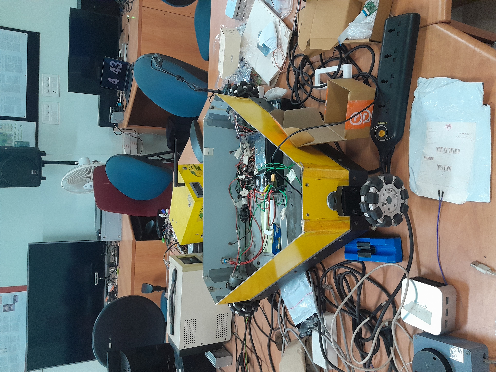
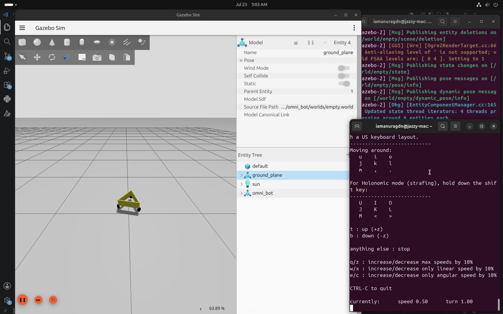
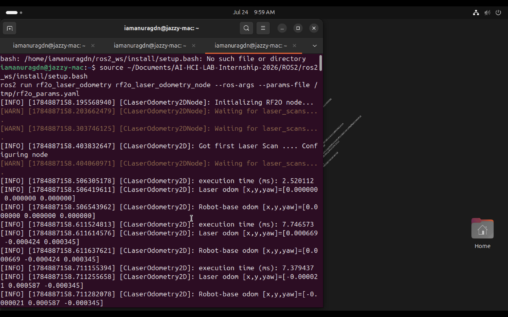
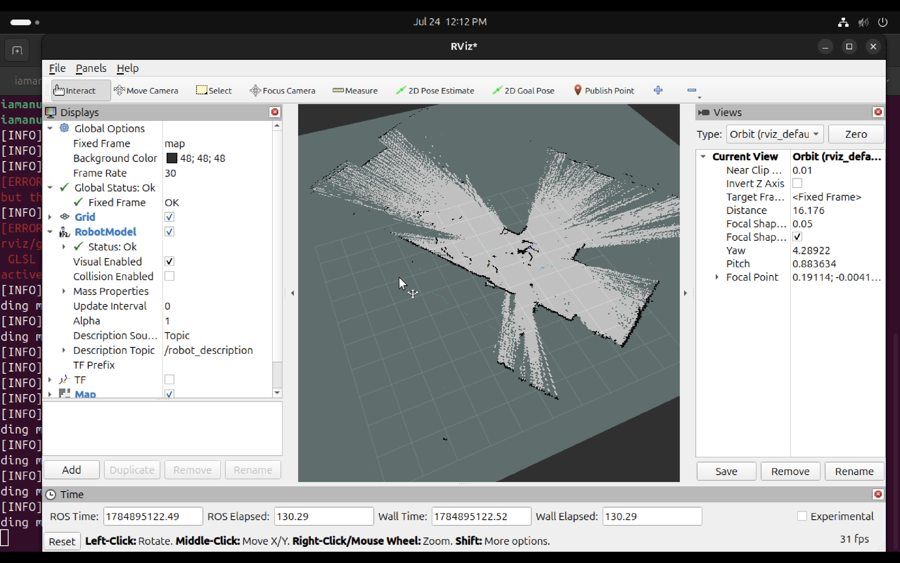

# Internship Weekly Log: Week 8

**Developer:** Anurag Debnath
**Date:** July 20-23, 2026
**Status:** 🟡 In Progress — Part 1 of 2 (home/simulation). Part 2 (real Arduino robot at college) to be added after that session.

---

## Day 1: July 23, 2026

## Robotics — Custom URDF for a 3-Wheel Omni/Holonomic Robot (`omni_bot`) in Gazebo Harmonic

**Hardware (reference only, not yet touched):** Real triangular-chassis Arduino robot, 3 omni wheels (one per corner), motor drivers, battery + XT60 connector — provided by the internship lab, not built by me.
**Environment:** Apple Silicon (M1) Mac, Ubuntu (jazzy-mac), ROS 2 Jazzy, Gazebo Harmonic (`gz sim` v8.11.0)

### ✅ What I Did

**1. Analyzed the Real Robot to Plan the Simulation**
* Sir's real internship robot is a triangular chassis with one omni wheel at each corner (3 wheels total) — mechanically different from my earlier `my_bot`, which uses 2 wheels (differential drive).
* Confirmed via photos: Arduino Uno as the current controller, a motor driver board, a 3.5" TFT LCD shield, and a battery pack — no onboard computer yet (this matters for Part 2).
* Researched TurtleBot (as instructed) and confirmed it's typically a 2-wheel differential-drive platform — different from this 3-wheel omni design, so the simulation needed its own custom kinematics rather than copying a TurtleBot model.

**2. Built a New Package (`omni_bot`), Separate From `my_bot`**
* Created as a sibling package under `ros2_ws/src/`, alongside `my_bot` and `sllidar_ros2` — kept separate since the two robots have different drive kinematics and shouldn't share a package.
* Structure (same convention as `my_bot`):
  * `description/robot_core.xacro` — triangular chassis (3 wall panels) + 3 wheel visuals at the triangle's vertices.
  * `description/inertial_macros.xacro` — reused inertia macros (same as `my_bot`).
  * `description/robot.urdf.xacro` — master file.
  * `launch/rsp.launch.py`, `launch/launch_sim.launch.py` — robot_state_publisher + full Gazebo sim launch.
  * `worlds/empty.world` — basic world with the sensors/physics plugins.
  * `scripts/fake_planar_move.py` — custom Python node (see below).
  * `OMNI_KINEMATICS.md` — worked-out 3-wheel omni kinematics math, for reuse in Part 2 (Arduino).

**3. Fixed Wheel Placement — Vertices, Not Edge Midpoints**
* First version incorrectly placed the 3 wheels at the same angles as the wall panel centers (mid-edges), rather than at the triangle's actual corners.
* Root cause: wall panels and wheels used the *same* angle set. For an equilateral triangle, vertex angles and edge-midpoint angles are 60° apart — they can't share one formula.
* Fix: kept wheels at vertex angles, shifted wall panels by +60° to sit at edge midpoints between them. Confirmed visually in Gazebo — wheels now sit exactly at the corners, matching the real robot's photos.

**4. Fixed Wheel Orientation — Radial Axis, Not Arbitrary**
* Wheels initially appeared oriented incorrectly (looked "vertical"/wrong in the Gazebo render).
* Root cause: each wheel's rotation axis needs to point **radially** (straight out from the robot's center through that wheel) so its rolling direction is **tangential** — this is the actual physical requirement for an omni/kiwi wheel to work. The original code had this backwards.
* Fix: recalculated the joint's `rpy` so the cylinder's default axis is correctly rotated to point radially at each wheel's mounting angle. Confirmed visually — wheels now look like proper upright wheels wrapping around the triangle, matching the real robot.

**5. Movement — Diagnosed and Replaced a Missing Gazebo Plugin**
* Original plan: use Gazebo's `PlanarMove` system plugin (a standard "shortcut" for holonomic bases — moves the whole body directly from `/cmd_vel` without simulating individual wheel friction).
* **Problem found:** this Gazebo Harmonic build (ROS 2 Jazzy vendor install) does not ship `PlanarMove` at all — confirmed via a real log error: `Failed to load system plugin [gz-sim-planar-move-system] : Could not find shared library.` Also checked for a `MecanumDrive` alternative, but that plugin is hardcoded for 4 named wheels, not compatible with this 3-wheel triangular layout.
* **Fix:** wrote a custom ROS 2 Python node (`fake_planar_move.py`) as a drop-in replacement:
  * Subscribes to `/cmd_vel`
  * Integrates `(vx, vy, ω)` into an `(x, y, yaw)` pose over time
  * Directly moves the robot via Gazebo's `/world/<world>/set_pose` service
  * Publishes `/odom` and broadcasts `/tf` itself (since no plugin does this anymore)
* Confirmed working end-to-end: robot responds to `/cmd_vel`, moves smoothly, and both forward/backward and sideways (`vy`) motion were tested via `ros2 topic pub` and `teleop_twist_keyboard`.

**6. Worked Out the Real 3-Wheel Omni Kinematics (for Part 2)**
* Documented the full formula converting `(vx, vy, ω)` into individual wheel speeds: `ωᵢ = (-sin(θᵢ)·vx + cos(θᵢ)·vy + L·ω) / R`
* Verified the math against physical intuition: for pure forward motion, the front wheel (aligned with the direction of travel) should require zero speed, while the back two wheels spin equally and oppositely — confirmed this holds with `wheel_angle_offset = 0°`, matching the real robot's front-wheel-forward layout.
* This math is **not used by the simulation** (which moves the body directly) but is saved specifically for writing the real Arduino motor-control code in Part 2.

<br>


### 📊 Results

| Metric | Value |
|--------|-------|
| **Package** | `omni_bot` (new, sibling to `my_bot`) |
| **Simulator** | Gazebo Harmonic (`gz sim` v8.11.0) |
| **Drive type** | 3-wheel omni/holonomic (triangular chassis) |
| **Movement method** | Custom `fake_planar_move.py` node (native `PlanarMove` plugin unavailable in this Gazebo build) |
| **Wheel placement** | ✅ Fixed — now at triangle vertices, matching real robot |
| **Wheel orientation** | ✅ Fixed — radial axis, tangential rolling direction |
| **Forward/backward motion** | ✅ Confirmed working |
| **Sideways (vy) motion** | ✅ Confirmed working (visually strafed in Gazebo) |
| **Rotation in place** | ✅ Confirmed working |
| **Odometry / TF** | ✅ Published directly by the custom node |
| **Real hardware measurements** | ⏳ Pending — chassis/wheel dimensions are still estimates from photos |
| **Real Arduino integration** | ⏳ Not started — Part 2, at college |

<br>

### 🧠 Key Learnings

- **Not every "standard" Gazebo plugin ships with every build.** `PlanarMove` is commonly referenced in tutorials but isn't guaranteed to exist in a given ROS distro's vendored Gazebo — checking the launch log for `Failed to load system plugin` errors (not just crashes) was the key diagnostic step.
- **Vertex angles ≠ edge-midpoint angles for a triangle** — these are 60° apart, and reusing one angle set for both wheels and wall panels was an easy mistake to make but produced an immediately visible (if easy to spot from screenshots) placement bug.
- **A wheel's rotation axis must point radially for tangential rolling** — this isn't just a visual/cosmetic detail, it's the actual physical requirement for an omni wheel to drive correctly, and getting the `rpy` math backwards silently produces a robot that "looks like a wheel" but is oriented to roll in the wrong direction.
- **`vx`/`vy`/`ω` are genuinely different capabilities, not one combined "speed."** A differential-drive robot can never use `vy` at all; confirming `vy` specifically (not just `vx` and `ω`) is what actually proves the holonomic design is functioning, not just "the robot moves."
- **When a bug report shows a huge/weird value (e.g. teleop speed at 578), check for compounding side effects before assuming the underlying system is broken** — in this case, repeated `w` presses had multiplied the speed exponentially, which initially looked like "nothing is moving" but was actually "moving too fast/far to see."

<br>

### ❌ Issues Faced & Solutions

| Issue | Cause | Solution |
|-------|-------|----------|
| Wheels appeared at mid-edges instead of triangle corners | Wall panels and wheels used the same angle set; vertex and edge-midpoint angles differ by 60° for an equilateral triangle | Shifted wall panel angles by +60°, kept wheels at original vertex angles |
| Wheels looked incorrectly oriented in Gazebo | Wheel rotation axis pointed in the wrong direction relative to robot center (not radial) | Recalculated joint `rpy` to point the cylinder's axis radially, making the rolling direction correctly tangential |
| Robot didn't move at all despite correct topics/bridge | `PlanarMove` Gazebo system plugin isn't present in this Gazebo Harmonic (Jazzy vendor) build | Wrote a custom ROS 2 node (`fake_planar_move.py`) that integrates `/cmd_vel` and moves the robot via Gazebo's `set_pose` service, plus publishes `/odom`/`/tf` itself |
| `colcon build` failed with a missing `config` directory error | `CMakeLists.txt` referenced a `config/` folder left over from copying `my_bot`'s structure, which `omni_bot` never actually has | Removed `config` from the `install(DIRECTORY ...)` line |
| Teleop speed became extremely high (500+) with no visible movement | Repeated `w` keypresses compound the speed by 10% each time; at very high speed the robot moves too far/fast between visible frames to notice | Restarted teleop fresh to reset to default speed, tested at a sane value (~0.3) |

<br>

### 📁 Files Created / Modified

- [robot_core.xacro](../ROS2/ros2_ws/src/omni_bot/description/robot_core.xacro) — triangular chassis, 3 wheel visuals, corrected placement + orientation.
- [inertial_macros.xacro](../ROS2/ros2_ws/src/omni_bot/description/inertial_macros.xacro) — reused inertia macros.
- [robot.urdf.xacro](../ROS2/ros2_ws/src/omni_bot/description/robot.urdf.xacro) — master robot file.
- [rsp.launch.py](../ROS2/ros2_ws/src/omni_bot/launch/rsp.launch.py) — robot_state_publisher launch.
- [launch_sim.launch.py](../ROS2/ros2_ws/src/omni_bot/launch/launch_sim.launch.py) — Gazebo sim + bridge + custom mover node launch.
- [empty.world](../ROS2/ros2_ws/src/omni_bot/worlds/empty.world) — basic world with sensors/physics plugins.
- [fake_planar_move.py](../ROS2/ros2_ws/src/omni_bot/scripts/fake_planar_move.py) — custom holonomic movement node (replaces missing `PlanarMove` plugin).
- [CMakeLists.txt](../ROS2/ros2_ws/src/omni_bot/CMakeLists.txt) / [package.xml](../ROS2/ros2_ws/src/omni_bot/package.xml) — build config, install rules, dependencies (`rclpy`, `geometry_msgs`, `nav_msgs`, `tf2_ros`, etc.).
- [OMNI_KINEMATICS.md](../ROS2/ros2_ws/src/omni_bot/OMNI_KINEMATICS.md) — 3-wheel omni kinematics formula + worked examples, for Part 2.
- [README.md](../ROS2/ros2_ws/src/omni_bot/README.md) — setup/build/launch instructions + assumptions to fix once real measurements are taken.

<br>

### 📸 Visual Evidence
<table>
  <tr>
    <td align="center" width="50%" valign="middle">
      <b>1. Real Robot</b><br>
      Reference photo of the 3-omni-wheel Arduino robot.<br><br>
      
    </td>
    <td align="center" width="50%" valign="middle">
      <b>2. Gazebo — Confirmed Movement</b><br>
      <code>omni_bot</code> moving forward, sideways, and rotating with <code>fake_planar_move.py</code>.<br><br>
      
    </td>
  </tr>
</table>

<br>

### ⏭️ Next Steps (Part 2 — At College)

1. [ ] Measure the real robot's triangle edge length, wheel radius, and wheel width; update the corresponding `xacro:property` values in `robot_core.xacro`.
2. [ ] Confirm with sir the intended direction convention for `vy` (sideways relative to robot heading vs. world frame) — noted as a question to ask.
3. [ ] Measure `L` (center-to-wheel distance) and `R` (wheel radius) for the real robot; plug into `OMNI_KINEMATICS.md`'s worked example.
4. [ ] Write the Arduino serial-listener sketch using the kinematics formula, reusing the existing motor-driving function (already working via the RC remote).
5. [ ] Write the Mac-side ROS 2 node that reads `/cmd_vel` and sends `vx,vy,ω` over USB serial to the Arduino.
6. [ ] Test in this order: raw serial values → keyboard teleop → real robot moving in sync with the simulation.

<br>

---
 
## Day 2: July 24, 2026
 
## Robotics — 2D SLAM Mapping with RPLIDAR C1 (Handheld, ROS 2 + slam_toolbox)
 
**Hardware:** RPLIDAR C1 (handheld, not yet mounted on the robot chassis)
**Environment:** Apple Silicon (M1) Mac, Ubuntu (jazzy-mac), ROS 2 Jazzy, RViz2, `slam_toolbox`, `rf2o_laser_odometry`
 

### ✅ What I Did
 
**1. Set Up the Full Handheld Mapping Pipeline**
* Goal for this session: produce a real 2D occupancy grid map using only the RPLIDAR C1, walked around by hand — no robot, no IMU fusion involved yet.
* Brought up the pipeline across seven separate terminals, each with one job:
  1. **LIDAR driver** (`sllidar_ros2`) — publishes raw `/scan` data.
  2. **Static transform** (`tf2_ros static_transform_publisher`) — defines the fixed offset between `base_link` and `laser`.
  3. **Laser odometry** (`rf2o_laser_odometry`) — estimates robot motion purely from scan matching, publishing `/odom`.
  4. **Odometry check** (`ros2 topic hz /odom`) — one-off verification terminal, closed after confirming a clean rate.
  5. **SLAM Toolbox** (`online_async_launch.py`) — builds the occupancy grid map from `/scan` + `/odom`.
  6. **RViz2** — visualizes `/map`, `/scan`, and the TF tree live.
  7. **Map status check** (`ros2 topic hz /map`) — one-off verification terminal, used to confirm the map topic was actually publishing.

**2. Diagnosed and Fixed a Silent `rf2o` Startup Bug**
* `rf2o_laser_odometry` was launching without errors but never actually publishing `/odom`.
* Root cause: the node's default `init_pose_from_topic` parameter was pointing at a topic that doesn't exist in this setup, so the node sat waiting indefinitely instead of starting from a zero pose.
* Fix: created an explicit params file setting `init_pose_from_topic: ""`, forcing the node to start immediately from the origin instead of waiting.
* Confirmed fixed: `/odom` began publishing at a steady ~10 Hz, with real, changing `[x, y, yaw]` values on both the laser-odom and robot-base-odom logs.

**3. Diagnosed a SLAM Toolbox Frame Mismatch**
* After bringing up SLAM Toolbox and RViz, `/map` never appeared, and RViz logged repeated `Failed to compute odom pose` warnings.
* Root cause: SLAM Toolbox's `base_frame` parameter in `mapper_params_online_async.yaml` didn't match the frame actually being published by the odometry/TF chain.
* Fix: corrected `base_frame: base_link` in the SLAM Toolbox config to match the real TF tree.
* Secondary issue found while testing: SLAM Toolbox will not process a scan or publish `/map` at all until the robot has moved past its configured `minimum_travel_distance` (0.5 m) or `minimum_travel_heading` (~0.5 rad) — an idle LIDAR looks identical to a broken pipeline until this is understood.

**4. Resolved an RViz "Blank Screen" Scare**
* At one point RViz showed nothing at all, not even the LIDAR scan points that had worked earlier.
* Root cause: the **Fixed Frame** field under Global Options had reset/emptied out, so RViz had nothing valid to render relative to.
* Fix: re-set Fixed Frame to `map` in Global Options, then re-added the `Map` and `LaserScan` displays by topic.

**5. Produced a Confirmed, Working Occupancy Grid Map**
* With all seven terminals running correctly and Fixed Frame set to `map`, walked the RPLIDAR C1 around by hand.
* `ros2 topic hz /map` began reporting a real publish rate, and RViz's Map display status changed from "No map received" to **OK**.
* A visible gray occupancy grid was drawn live in RViz, built entirely from LIDAR scan matching — the first successful end-to-end map from this hardware.

**6. Identified Map Quality Issues for Future Improvement**
* The resulting map came out noisy and stretched into a star/X-like pattern rather than clean straight walls.
* Diagnosed cause: this is a scan-matching accuracy issue, not a pipeline failure — `rf2o` odometry is pure scan-matching with no wheel encoders, so it loses tracking easily during fast or jerky rotations, and natural handheld sway/tilt adds further noise.
* Noted concrete fixes for the next mapping pass: move and rotate slowly with pauses between motions, walk a closed loop around the room so SLAM Toolbox gets loop-closure opportunities to correct drift, and keep the LIDAR's height/tilt as constant as possible while walking.
<br>

### 📸 Visual Evidence
<table>
  <tr>
    <td align="center" width="50%" valign="middle">
      <b>1. Confirmed Odometry</b><br>
      <code>rf2o_laser_odometry</code> initializing, receiving its first laser scan, and publishing real, changing <code>Laser odom [x,y,yaw]</code> and <code>Robot-base odom [x,y,yaw]</code> values after the <code>init_pose_from_topic</code> fix.<br><br>
      
    </td>
    <td align="center" width="50%" valign="middle">
      <b>2. RViz — Working Map Display</b><br>
      Fixed Frame set to <code>map</code>, Global Status OK, with the completed occupancy grid rendered live from the handheld LIDAR walk.<br><br>
      
    </td>
  </tr>
</table>
<br>

### 📊 Results
 
| Metric | Value |
|--------|-------|
| **Sensor used** | RPLIDAR C1 (handheld only) |
| **Odometry source** | `rf2o_laser_odometry` (pure scan-matching, no IMU/encoders) |
| **SLAM package** | `slam_toolbox` (`online_async_launch.py`) |
| **Terminals used** | 7 (LIDAR driver, static TF, laser odometry, odom check, SLAM Toolbox, RViz2, map check) |
| **`/odom` publish rate** | ✅ Confirmed ~10 Hz |
| **`/map` topic** | ✅ Confirmed publishing |
| **RViz Map display status** | ✅ OK |
| **Occupancy grid produced** | ✅ Yes — first successful handheld map |
| **Map quality** | 🟡 Noisy / distorted (scan-matching drift) — needs a slower, looped walk to clean up |
| **IMU (D455) fusion** | ⏳ Not included in this session — separate task, to be worked on later |
| **Real robot mounting** | ⏳ Not started — this session was handheld only |
 
<br>

### 📁 Files Created / Modified

- [rf2o_params.yaml](../ROS2/ros2_ws/src/my_bot/config/rf2o_params.yaml) — explicit `rf2o_laser_odometry` parameters, fixing the `init_pose_from_topic` startup bug.
- [mapper_params_online_async.yaml](../ROS2/ros2_ws/src/my_bot/config/mapper_params_online_async.yaml) — corrected `base_frame` to match the real TF tree.
- [rf2o_params.yaml](../ROS2/mapping/rf2o_params.yaml) and [mapper_params_online_async.yaml](../ROS2/mapping/mapper_params_online_async.yaml) — backup/reference copies stored in the dedicated `mapping/` folder under `ROS2/`.

<br>

### 🧠 Key Learnings
 
- **A node can launch cleanly with zero errors and still do nothing.** `rf2o_laser_odometry` started without complaint but silently waited forever on a default parameter (`init_pose_from_topic`) pointing at a nonexistent topic — checking whether a topic is *actually publishing data* is a separate check from whether the node process is *running*.
- **SLAM Toolbox needs real movement before it does anything.** An empty `/map` topic with no errors usually means the minimum travel distance/heading threshold simply hasn't been crossed yet, not that something is broken — this cost real debugging time before the threshold behavior was understood.
- **RViz's Fixed Frame is a single point of failure for the entire view.** Every display can be correctly configured and still render nothing if Global Options → Fixed Frame is empty or invalid; checking that field first is now the standard first step whenever RViz appears blank.
- **A visibly noisy/distorted map is a sign of degraded accuracy, not a failed pipeline.** Handheld, encoder-free scan-matching (`rf2o`) is inherently more sensitive to fast rotation and sway than a wheeled robot would be — the fix is technique (move slower, loop the path) rather than re-debugging the software stack.
- **Rebuilding a working setup from scratch, one terminal at a time, is faster than debugging a tangled live session.** After several terminals became hard to track, closing everything and restarting the exact seven-step sequence in order resolved the confusion faster than trying to fix the running state in place.
<br>

### ❌ Issues Faced & Solutions
 
| Issue | Cause | Solution |
|-------|-------|----------|
| `/odom` never published any data | `rf2o_laser_odometry`'s default `init_pose_from_topic` parameter waited on a topic that doesn't exist | Created a params YAML explicitly setting `init_pose_from_topic: ""` so the node starts from origin immediately |
| RViz showed `Failed to compute odom pose` and no `/map` | SLAM Toolbox's `base_frame` parameter didn't match the actual TF tree | Corrected `base_frame: base_link` in `mapper_params_online_async.yaml` |
| `/map` topic showed "does not appear to be published yet" even with a correct TF tree | SLAM Toolbox requires movement past `minimum_travel_distance`/`minimum_travel_heading` before it processes its first scan | Physically walked/rotated the LIDAR past the threshold before rechecking |
| RViz view went completely blank (no scan points, no map) | Global Options → Fixed Frame was empty/reset | Re-set Fixed Frame to `map`, re-added Map and LaserScan displays by topic |
| Resulting map was noisy and stretched into a star/X shape | `rf2o` scan-matching odometry drifts during fast/jerky handheld rotation | Identified fix for next pass: move slowly, pause between turns, walk a closed loop for loop-closure correction |
| Too many terminals open, session became hard to track | Iterative debugging left old terminals running with stale state | Closed everything and restarted the full 7-terminal sequence cleanly, in order |
 
<br>

### ▶️ How to Run This — Step by Step (7 Terminals)
 
**Terminal 1 — LIDAR driver**
```bash
source ~/Documents/AI-HCI-LAB-Internship-2026/ROS2/ros2_ws/install/setup.bash
ros2 launch sllidar_ros2 sllidar_c1_launch.py
```
This publishes raw laser data on `/scan`. Leave it running, don't touch it again.
 
**Terminal 2 — static transform (tells ROS where the laser sits on the robot)**
```bash
source ~/Documents/AI-HCI-LAB-Internship-2026/ROS2/ros2_ws/install/setup.bash
ros2 run tf2_ros static_transform_publisher 0 0 0 0 0 0 base_link laser
```
Leave running.
 
**Terminal 3 — laser odometry (estimates how much you've moved from scan data)**
```bash
source ~/Documents/AI-HCI-LAB-Internship-2026/ROS2/ros2_ws/install/setup.bash
ros2 run rf2o_laser_odometry rf2o_laser_odometry_node --ros-args --params-file ~/Documents/AI-HCI-LAB-Internship-2026/ROS2/ros2_ws/src/my_bot/config/rf2o_params.yaml
```
Leave Terminal 3 running.
 
**Terminal 4 — quick check, then close it**
```bash
source ~/Documents/AI-HCI-LAB-Internship-2026/ROS2/ros2_ws/install/setup.bash
ros2 topic hz /odom
```
Confirm you see ~10 Hz. Then `Ctrl+C` and close this terminal — it was just a check.
 
**Terminal 5 — SLAM Toolbox (the map builder, using the fixed config)**
```bash
source ~/Documents/AI-HCI-LAB-Internship-2026/ROS2/ros2_ws/install/setup.bash
ros2 launch slam_toolbox online_async_launch.py slam_params_file:=/home/iamanuragdn/Documents/AI-HCI-LAB-Internship-2026/ROS2/ros2_ws/src/my_bot/config/mapper_params_online_async.yaml use_sim_time:=false
```
 Leave running. Confirm no `Failed to compute odom pose` warnings appear.
 
**Terminal 6 — RViz2**
```bash
source ~/Documents/AI-HCI-LAB-Internship-2026/ROS2/ros2_ws/install/setup.bash
rviz2
```
In RViz, do these in exact order:
1. Top-left, find **Global Options → Fixed Frame** dropdown → type/select `map`
2. Click **Add** (bottom-left) → *By topic* tab → find `/map` → add it
3. Click **Add** again → *By topic* → find `/scan` → add **LaserScan**
Now pick up the LIDAR and physically walk/rotate at least half a meter or turn ~30° — SLAM Toolbox will not draw anything until you move that much.
 
**Terminal 7 — map status check**
```bash
source ~/Documents/AI-HCI-LAB-Internship-2026/ROS2/ros2_ws/install/setup.bash
ros2 topic hz /map
```
Run this in a spare terminal — you should see it start publishing once you've moved enough, and RViz's Map display status should switch from "No map received" to **OK**.
 
<br>

### 📁 Files Created / Modified
 
- `ros2_ws/src/my_bot/config/rf2o_params.yaml` — explicit `rf2o_laser_odometry` parameters, fixing the `init_pose_from_topic` startup bug.
- `ros2_ws/src/my_bot/config/mapper_params_online_async.yaml` — corrected `base_frame` to match the real TF tree.
- `mapping/` (New directory under `ROS2/`) — created as a dedicated reference folder to cleanly store backup copies of `rf2o_params.yaml` and `mapper_params_online_async.yaml` for easy navigation later.

<br>

### ⏭️ Next Steps
 
1. [ ] Redo the handheld walk slowly, pausing between rotations, to reduce `rf2o` scan-matching drift.
2. [ ] Walk a closed loop around the room to give SLAM Toolbox loop-closure opportunities and clean up the map shape.
3. [ ] Save a clean map using `ros2 run nav2_map_server map_saver_cli -f ~/my_map` once quality improves.
4. [ ] Consider tuning `angle_variance_penalty` / `distance_variance_penalty` in the SLAM Toolbox config if drift persists after a slower walk.
5. [ ] Once a clean map exists, mount the RPLIDAR C1 on the actual robot chassis and repeat mapping using real wheel odometry instead of handheld `rf2o`.
6. [ ] Revisit D455 IMU fusion as a separate, later task — not part of this mapping session.
<br>


